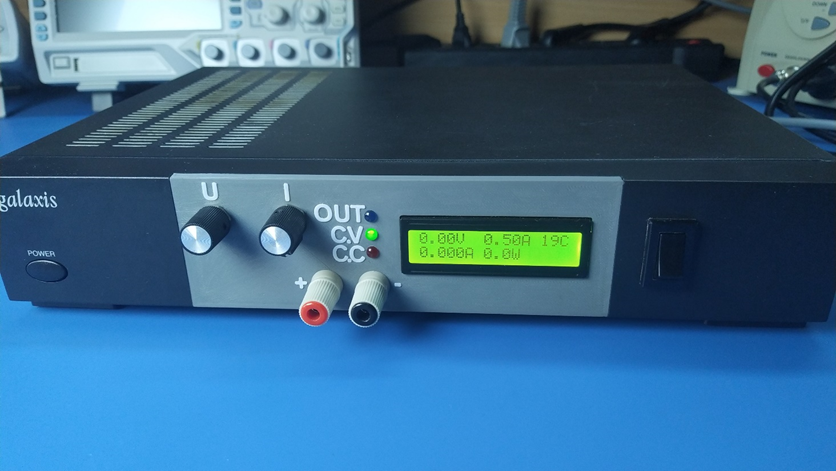

# Linear power supply

> [!CAUTION]
> This project was initiated in 2021 when my skills were more limited. As a result, there might be areas for improvement. I occasionally enhance both the performance and readability of project files for better understanding.

### More info about this project can be found on my channel: 
 https://youtu.be/JCxF-o6tLgA

## Used tools:
 &nbsp;&nbsp;&nbsp;&nbsp; &nbsp;&nbsp;&nbsp;&nbsp; 

#

## Project Overview
- Homemade linear power supply capable of delivering up to 250W (0-28V, 0.01-10A)
- Features adjustable voltage and current limit, controlled by 10-turn potentiometers.
- Incorporates an on/off switch for convenient power control.
- Utilizes a relay transformer-tab switching circuit to minimize power losses by reducing the voltage differential across the linear regulator.
- Enhanced heat dissipation through a temperature-controlled fan cooling the heatsink.

 

> [!IMPORTANT]
> I changed the Q1 transistor from IRF9530 (P-MOSFET) to BD912 (PNP-BJT) to gratly improve the stability of this power supply and completely eliminate oscillations in the constant current mode. (Their pinouts match, so it is a drop in replacement)
> 

> 
Click to learn more

> After performing some simulations in LTspice, I figured out that simply changing the Q1 MOSFET to a BJT greatly improved the output response to input step:
> Before (with MOSFET):
> <image src="images/screenshots/old_step.png">
> After (with BJT)
> <image src="images/screenshots/new_step.png">
> (The bode plot also looks better)
> 

## Otput Measurements
Output voltage waveforms before changing Q1 to a BJT can be found in measurements.pdf

## Project details
I used this 12 300VA transformer, which I sligtly modified. The secondary winding consisted of 4 wires connected in parallel. I split them in 2 and connected in series, getting 24V with a center tap). Last but not least I added another winding of around 8V.

I used an old graphics card's heatsink for cooling.

It was based on SN1534 power supply, its schematics can be found there as well.
